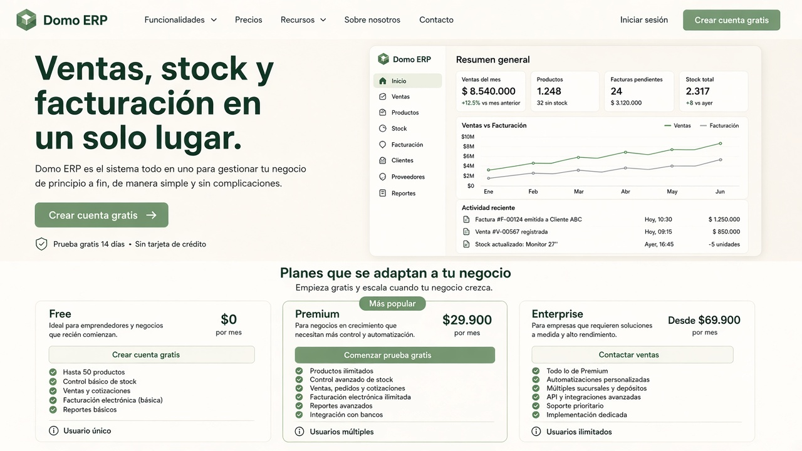
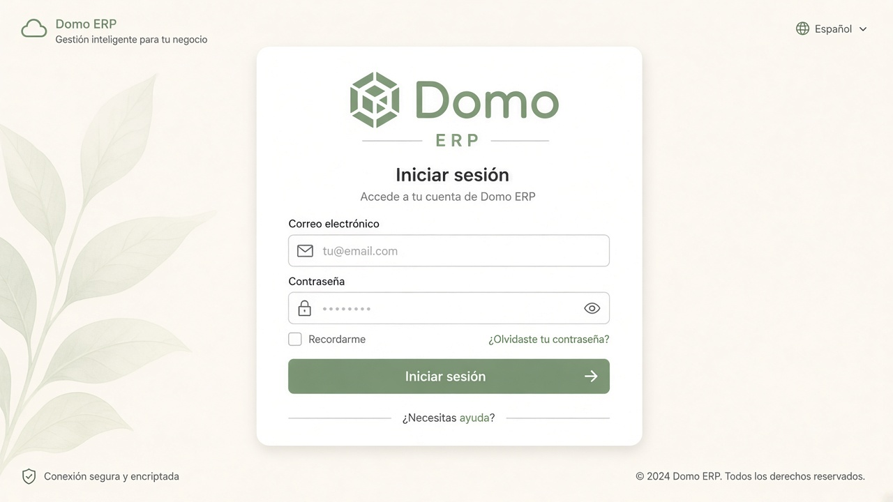
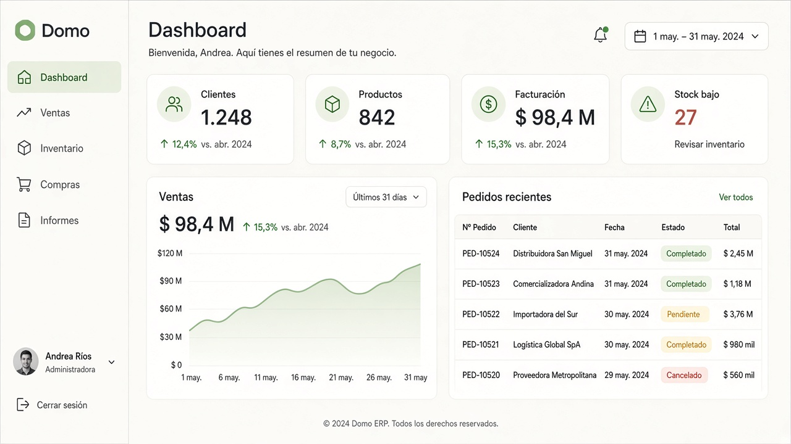
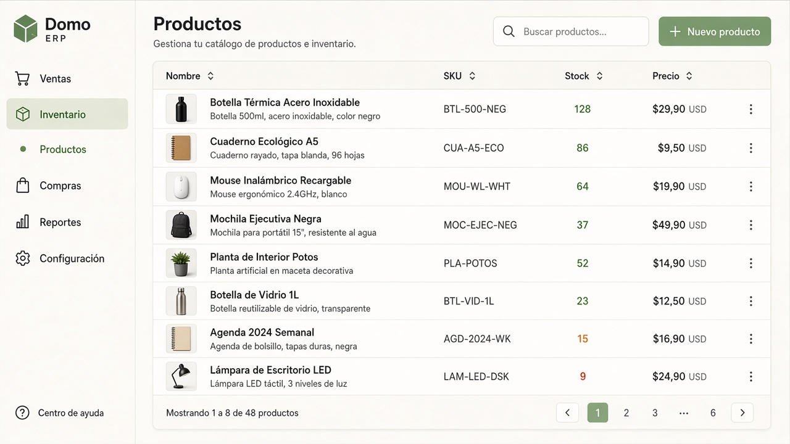
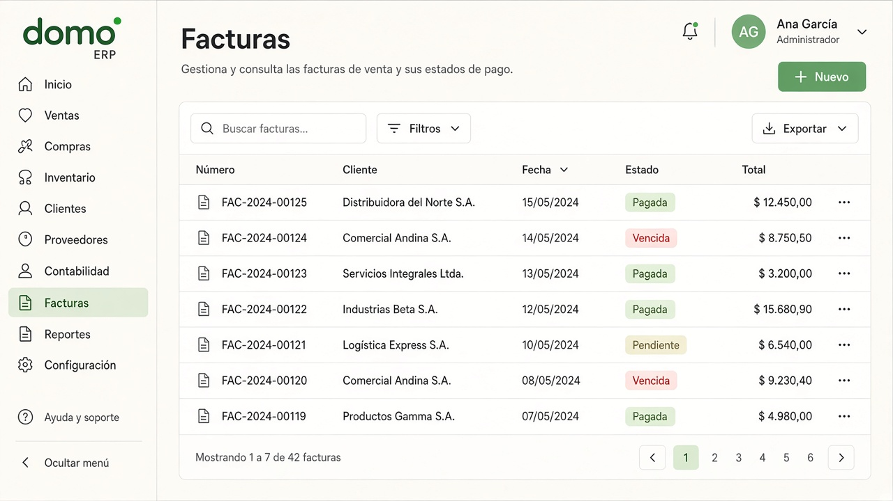

# Domo

**ERP SaaS multiempresa** para gestionar ventas, inventario, compras, facturación e informes en un solo lugar.

Domo está pensado para pymes que quieren empezar rápido (plan Free) y escalar a CRM, tesorería, contabilidad, proyectos y fabricación según crezcan.

<p align="center">
  
</p>

## Capturas

### Login



### Dashboard



### Inventario — Productos



### Ventas — Facturas



---

## ¿Qué es Domo?

Domo centraliza el ciclo comercial y operativo:

1. **Clientes y presupuestos** → convierte oportunidades en pedidos  
2. **Pedidos e inventario** → confirma ventas y descuenta stock por almacén  
3. **Facturas y cobros** → controla vencimientos, pagos parciales y estado de cobro  
4. **Compras** → proveedores y órdenes de compra  
5. **Informes** → ventas, finanzas y valoración de stock (export CSV/XLSX)

Todo el acceso está **aislado por empresa** (`companyId` en el JWT): los datos de un tenant no se mezclan con los de otro.

---

## Módulos principales

| Área | Funcionalidades |
|------|-----------------|
| **Dashboard** | KPIs (clientes, productos, facturación, stock bajo), gráfico de ventas, acciones rápidas |
| **Ventas** | Clientes, presupuestos, pedidos, facturas y cobros |
| **Inventario** | Productos, categorías, almacenes, movimientos de stock |
| **Compras** | Proveedores y órdenes de compra |
| **Informes** | Ventas, finanzas, valoración de stock |
| **Premium+** | CRM, tesorería, contabilidad, proyectos, fabricación |
| **Configuración** | Usuarios, roles (RBAC), invitaciones, facturación SaaS, apariencia, auditoría |

### Planes (resumen)

| Plan | Enfoque |
|------|---------|
| **Free** | Ventas, compras e inventario básico (hasta 2 usuarios) |
| **Premium** | Informes avanzados, CRM, tesorería, contabilidad; sin marca de agua en PDF |
| **Enterprise** | Proyectos, fabricación, API/webhooks, usuarios ilimitados |

---

## Stack tecnológico

| Capa | Tecnología |
|------|------------|
| Frontend | React 19, Vite, TypeScript, Tailwind CSS, TanStack Query, Zustand |
| Backend | NestJS, Prisma, PostgreSQL, Redis (BullMQ) |
| Auth | JWT (access + refresh), cookies httpOnly, 2FA TOTP opcional |
| Otros | Docker Compose, Swagger, Stripe (billing), S3 (adjuntos), Sentry |

```text
ERP/
├── erp-saas-frontend/   # App React (Vite)
├── erp-saas-backend/    # API NestJS + Prisma
└── docs/images/         # Capturas del README
```

---

## Requisitos

- **Node.js 20+**
- **Docker** (PostgreSQL + Redis)
- **npm**

---

## Arranque local

### 1. Backend

```bash
cd erp-saas-backend
copy .env.example .env
docker compose up -d postgres redis
npm install
npx prisma migrate deploy
npm run db:seed
npm run start:dev
```

| Recurso | URL |
|---------|-----|
| API | http://localhost:3000/api/v1 |
| Health | http://localhost:3000/api/v1/health |
| Swagger | http://localhost:3000/docs |

### 2. Frontend

```bash
cd erp-saas-frontend
npm install
npm run dev
```

- App: http://localhost:5173  
- El proxy de Vite reenvía `/api` → `http://localhost:3000`

### Usuarios demo (tras el seed)

| Email | Contraseña | Rol |
|-------|------------|-----|
| `admin@demo.com` | `admin123` | Administrador |
| `ventas@demo.com` | `ventas123` | Ventas (sin facturas) |

El seed incluye productos, clientes, proveedores, almacén, stock, un pedido confirmado y facturas de ejemplo.

---

## Funcionalidades destacadas (Fase A)

- **Inventario con ledger** — movimientos de stock por almacén, ajustes y descuento al confirmar pedidos  
- **Cobros en facturas** — estados `partially_paid` / `paid` e informes con cobros reales  
- **Email** — invitaciones y verificación (consola / SMTP / Resend)  
- **RBAC** — permisos en API y rutas protegidas en el frontend  
- **Exportación** — CSV/XLSX en informes  
- **Fichas configurables** — layouts y campos personalizados  

Documentación adicional:

- Backend: [erp-saas-backend/README.md](erp-saas-backend/README.md)  
- Frontend: [erp-saas-frontend/README.md](erp-saas-frontend/README.md)  
- Roadmap: [erp-saas-backend/docs/PHASED_ROADMAP.md](erp-saas-backend/docs/PHASED_ROADMAP.md)  
- Smoke test: [erp-saas-backend/docs/SMOKE_TEST.md](erp-saas-backend/docs/SMOKE_TEST.md)

---

## Variables de entorno (resumen)

Copia `erp-saas-backend/.env.example` → `.env`. Lo esencial:

| Variable | Uso |
|----------|-----|
| `DATABASE_URL` | PostgreSQL (puerto **5433** en Docker local) |
| `JWT_SECRET` / `JWT_REFRESH_SECRET` | Secretos de tokens (cámbialos en producción) |
| `CORS_ORIGIN` / `FRONTEND_URL` | Origen del frontend |
| `EMAIL_PROVIDER` | `console`, `smtp` o `resend` |

Desarrollo sin SMTP:

```env
EMAIL_PROVIDER=console
EMAIL_VERIFICATION_ENABLED=false
```

---

## Scripts útiles

**Backend**

```bash
npm run start:dev      # API con hot reload
npm run db:seed        # Datos demo
npx prisma studio      # Explorar la BD
npm run build && npm run start:prod
```

**Frontend**

```bash
npm run dev            # Vite
npm run build          # Build de producción
npm run test           # Vitest
npm run test:e2e       # Playwright
```

---

## Seguridad y multiempresa

- Autenticación JWT + refresh; opción de cookies httpOnly  
- Bloqueo de cuenta tras intentos fallidos  
- 2FA TOTP opcional  
- Autorización por permisos (RBAC)  
- Aislamiento estricto por `companyId`  

---

## Licencia

Proyecto privado. Todos los derechos reservados © Domo / AlejoIII.
