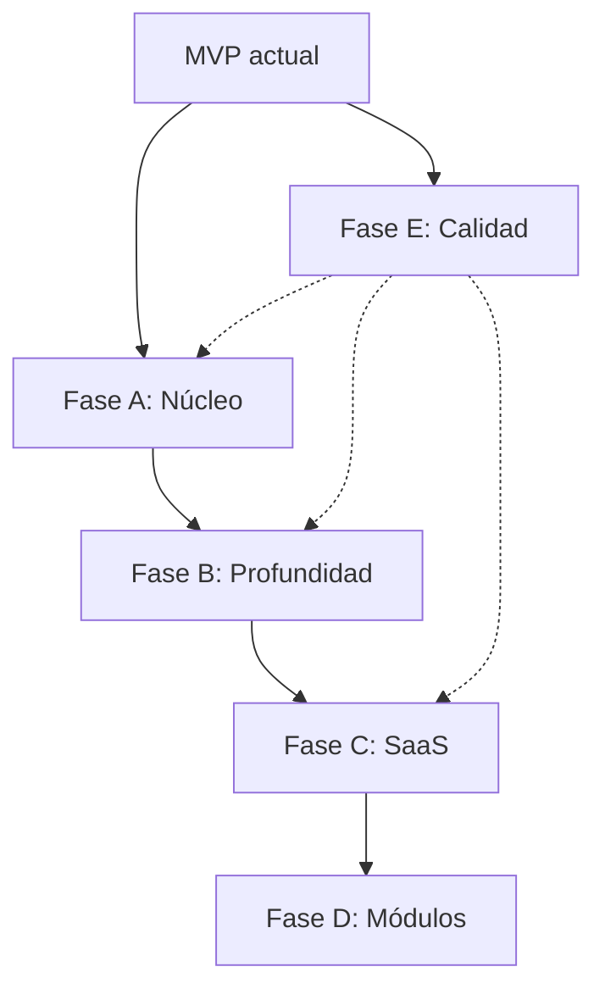

# Domo ERP — Plan de mejoras por fases (Spec)

> **Versión:** 1.0  
> **Fecha:** Julio 2026  
> **Alcance:** `erp-saas-backend` + `erp-saas-frontend`  
> **Estado base:** MVP funcional (ventas, compras, inventario básico, informes, RBAC, fichas configurables, avisos in-app)

---

## 1. Visión y principios

### 1.1 Objetivo del plan

Llevar Domo de **MVP demostrable** a **ERP usable en producción** y, posteriormente, a **SaaS comercializable**, sin añadir módulos nuevos antes de cerrar los flujos críticos del núcleo.

### 1.2 Principios de priorización

1. **Profundidad antes que amplitud** — mejorar inventario y cobros antes de abrir contabilidad o fabricación.
2. **Cada fase entrega valor usable** — no bloques de trabajo que solo “preparan el terreno”.
3. **Backend y frontend en paralelo** — cada ítem incluye criterios de aceptación en ambos lados.
4. **Multi-tenant desde el diseño** — todo scoped por `companyId`.
5. **Permisos reales** — si existe en API, debe existir en UI (y viceversa para rutas sensibles).

### 1.3 Definiciones

| Término | Significado |
|---------|-------------|
| **Done** | Implementado, con criterios de aceptación cumplidos y sin regresiones en flujos existentes |
| **MVP de fase** | Subconjunto mínimo que permite desplegar la fase a usuarios reales |
| **Out of scope** | Explícitamente excluido de la fase (puede entrar en fases posteriores) |

---

## 2. Estado actual (baseline)

### 2.1 Implementado

- Auth: registro empresa, login, JWT, invitaciones (sin email), perfil, cambio contraseña
- Maestros: clientes, productos, categorías, almacenes, proveedores, empleados
- Documentos: presupuestos, pedidos, facturas, órdenes de compra (CRUD + conversiones parciales)
- Stock: ajuste en pedidos/OC sobre `Product.stock`; stock por almacén manual (`WarehouseStock`)
- Informes: ventas y finanzas (JSON, sin export)
- Dashboard: KPIs, gráfico 6 meses, stock bajo
- RBAC: 18 permisos, roles CRUD, asignación usuarios
- Settings: empresa, documentos, fichas, avisos (persistidos en usuario), apariencia local
- Adjuntos: clientes e invoices (local disk)
- Auditoría: registro + visor en settings
- Impresión: presupuestos, pedidos, facturas (navegador)

### 2.2 Deuda conocida

- `Product.stock` y `WarehouseStock` no sincronizados
- Invitaciones y verificación email sin envío SMTP
- Permisos no aplicados en rutas frontend
- Sin tests automatizados ni CI frontend
- Almacenamiento local de archivos
- Sin planes/billing SaaS
- i18n solo selector (UI en español)

---

## 3. Resumen de fases

| Fase | Nombre | Duración est. | Objetivo |
|------|--------|---------------|----------|
| **A** | Núcleo production-ready | 4–6 semanas | ERP usable a diario sin descuadres críticos |
| **B** | Profundidad y retención | 6–8 semanas | Más valor en módulos existentes |
| **C** | Producto SaaS | 8–10 semanas | Comercializable multi-tenant |
| **D** | Expansión de módulos | 10+ semanas | Nuevas áreas según segmento |
| **E** | Calidad y operaciones | Transversal | Paralelo a A–C desde sprint 2 |



---

## 4. Fase A — Núcleo production-ready

**Objetivo:** Un equipo puede operar ventas, compras e inventario sin workarounds manuales ni riesgos de seguridad básicos.

**Duración:** 4–6 semanas  
**Dependencias:** Ninguna (arranca desde baseline)

---

### A1. Inventario unificado

#### Problema
Existen dos modelos de stock (`Product.stock` global vs `WarehouseStock` por almacén) sin reconciliación.

#### Spec funcional

- Todo movimiento de stock genera un **registro en ledger** (`StockMovement`).
- `Product.stock` = suma de cantidades en todos los almacenes activos de la empresa (campo calculado o mantenido por trigger/servicio).
- Operaciones que mueven stock:
  - Confirmar/enviar/entregar/facturar pedido → salida del almacén por defecto (configurable en empresa).
  - Recibir OC → entrada al almacén destino de la OC.
  - Ajuste manual en ficha de almacén → movimiento tipo `adjustment`.
- **Stock negativo:** configurable por empresa (`allowNegativeStock: boolean`, default `false`).
- Almacén por defecto: `Company.defaultWarehouseId` (nullable; si null, usar el único almacén o bloquear operaciones que requieran stock).

#### Modelo de datos (Prisma)

```prisma
model StockMovement {
  id          String   @id @default(uuid())
  companyId   String
  productId   String
  warehouseId String
  type        String   // in | out | adjustment | transfer
  quantity    Decimal  // positivo=entrada, negativo=salida
  reference   String?  // order_id, po_id, etc.
  referenceType String? // sales_order | purchase_order | manual
  notes       String?
  createdBy   String?
  createdAt   DateTime @default(now())
  // relations + indexes
}

// Company: defaultWarehouseId, allowNegativeStock
// SalesOrder / PurchaseOrder: warehouseId (opcional, fallback default)
```

#### API

| Método | Ruta | Descripción |
|--------|------|-------------|
| GET | `/inventory/movements` | Listado paginado con filtros (producto, almacén, fechas, tipo) |
| GET | `/products/:id/stock` | Desglose por almacén + total |
| POST | `/warehouses/:id/stock/adjust` | Ajuste con motivo (reemplaza input UUID manual) |

#### Frontend

- `WarehouseFormPage`: selector de producto (autocomplete), cantidad, motivo
- `ProductFormPage`: pestaña “Stock por almacén” (solo lectura + enlace a ajuste)
- Validación en `OrderFormPage` / `PurchaseOrderFormPage`: aviso si stock insuficiente al confirmar

#### Criterios de aceptación

- [ ] Tras confirmar pedido, stock baja en almacén correcto y aparece movimiento en ledger
- [ ] Tras recibir OC, stock sube coherente
- [ ] Suma por almacenes = `Product.stock` mostrado en listado
- [ ] Con `allowNegativeStock=false`, API rechaza operación que dejaría stock < 0
- [ ] Histórico de movimientos visible y filtrable

#### Out of scope (Fase A)

- Transferencias entre almacenes (Fase B)
- Inventario físico / conteo cíclico (Fase B)

---

### A2. Cobros y estado de facturas

#### Problema
Las facturas tienen totales pero no hay registro de pagos ni saldo pendiente operativo.

#### Spec funcional

- Estados de factura ampliados: `draft | issued | partially_paid | paid | overdue | cancelled`
- Entidad **Payment** vinculada a factura(s)
- Campos calculados: `paidAmount`, `balanceDue`
- `overdue` derivado: `issued` + `dueDate < today` + `balanceDue > 0`
- Registrar pago: fecha, importe, método (`cash | transfer | card | other`), referencia opcional
- Pagos parciales permitidos
- Informe finanzas usa cobros reales, no solo facturación

#### Modelo de datos

```prisma
model Payment {
  id          String   @id @default(uuid())
  companyId   String
  invoiceId   String
  amount      Decimal
  paymentDate DateTime
  method      String
  reference   String?
  notes       String?
  createdBy   String?
  createdAt   DateTime @default(now())
}
```

#### API

| Método | Ruta | Descripción |
|--------|------|-------------|
| GET | `/invoices/:id/payments` | Pagos de una factura |
| POST | `/invoices/:id/payments` | Registrar pago |
| DELETE | `/payments/:id` | Anular pago (permiso `invoices.write`) |
| GET | `/reports/finance` | Incluir `collected`, `outstanding`, aging básico |

#### Frontend

- `InvoiceFormPage`: sección “Pagos” con listado + modal registrar pago
- Badge de estado en `InvoicesPage` (pagada / parcial / vencida)
- Dashboard: widget “Pendiente de cobro”

#### Criterios de aceptación

- [ ] Pago parcial actualiza estado a `partially_paid`
- [ ] Pago total → `paid`
- [ ] Informe finanzas refleja cobros del periodo
- [ ] Aviso campanita “factura vencida” usa `balanceDue > 0`

---

### A3. Email operativo

#### Problema
Invitaciones y verificación existen pero no envían correo; onboarding manual.

#### Spec funcional

- Variable `EMAIL_VERIFICATION_ENABLED` activable por env
- Flujos con email:
  1. **Invitación usuario** — enlace `accept-invite?token=...`
  2. **Verificación registro** (opcional por env)
  3. **Reenvío verificación**
- Plantillas HTML mínimas (asunto + cuerpo con enlace)
- Fallback: si SMTP falla, API devuelve `inviteUrl` / `devCode` en respuesta (solo dev)
- Config SMTP en `.env`: `SMTP_HOST`, `SMTP_PORT`, `SMTP_USER`, `SMTP_PASS`, `MAIL_FROM`

#### API / cambios

- `POST /settings/invitations` — dispara email; respuesta incluye `emailSent: boolean`
- `POST /auth/register` — si verificación ON, no devuelve tokens hasta verificar
- `POST /auth/resend-verification` — ya existe, conectar envío real

#### Frontend

- `InvitationsSection`: mensaje “Email enviado” o error claro
- `VerifyEmailPage`: flujo activo cuando backend lo exige
- Settings (admin): indicador “Email configurado” / enlace a docs

#### Criterios de aceptación

- [ ] Invitación llega a bandeja de prueba (Mailtrap o similar)
- [ ] Enlace de invitación funciona end-to-end
- [ ] Sin SMTP configurado, modo dev no rompe (muestra URL)

---

### A4. Permisos en rutas frontend

#### Problema
Sidebar oculta ítems pero URLs directas son accesibles.

#### Spec funcional

- Componente `PermissionRoute` — wrapper que comprueba permiso(s) requeridos
- Mapa ruta → permiso(s) derivado de `menu.config.ts` (single source of truth)
- Sin permiso: pantalla “Sin acceso” (403 UI), no redirect silencioso a dashboard
- Botones de acción (crear, editar, eliminar) deshabilitados/ocultos según permiso write

#### Implementación

```tsx
// router.tsx
{ path: 'clients', element: <PermissionRoute permission="clients.read"><ClientsPage /></PermissionRoute> }
```

- Hook `useCan(permission)` para formularios
- Alinear permisos de adjuntos con entidad real (hoy hardcoded a clients)

#### Criterios de aceptación

- [ ] Usuario sin `invoices.read` no ve listado ni formulario por URL
- [ ] Usuario con read sin write ve formulario solo lectura
- [ ] Admin mantiene acceso completo

---

### A5. Exportación de informes

#### Spec funcional

- Export CSV y Excel (.xlsx) en informes ventas y finanzas
- Respeta filtros de fecha activos en pantalla
- Nombre archivo: `{informe}_{empresa}_{fecha}.csv`

#### API

| Método | Ruta | Descripción |
|--------|------|-------------|
| GET | `/reports/sales/export?format=csv\|xlsx&from=&to=` | Descarga |
| GET | `/reports/finance/export?format=csv\|xlsx&from=&to=` | Descarga |

#### Frontend

- Botones “Exportar CSV” / “Exportar Excel” en `SalesReportPage` y `FinanceReportPage`

#### Criterios de aceptación

- [ ] CSV abre correctamente en Excel/LibreOffice con encoding UTF-8
- [ ] Totales coinciden con vista en pantalla

---

### A6. MVP entregable Fase A

**Checklist de release:**

- [x] A1–A5 completados
- [x] Seed actualizado con pagos y movimientos de demo
- [x] README actualizado con variables SMTP e inventario
- [x] Smoke manual documentado → [docs/SMOKE_TEST.md](./SMOKE_TEST.md)
- [ ] Migraciones Prisma aplicadas en entorno staging
- [ ] Smoke manual ejecutado y firmado

---

## 5. Fase B — Profundidad y retención

**Objetivo:** Más valor en lo existente; reducir fricción diaria y aumentar retención.

**Duración:** 6–8 semanas  
**Dependencias:** Fase A (especialmente A1 inventario y A2 cobros)

---

### B1. Flujo documental completo

| ID | Feature | Spec resumida |
|----|---------|---------------|
| B1.1 | Albarán / delivery note | Estado `delivered` con `deliveryDate`, `deliveryNoteNumber`; impresión albarán |
| B1.2 | Imprimir OC | `DocumentPrintPage` para purchase-orders |
| B1.3 | Duplicar documento | Acción “Duplicar” en quote/order/invoice/PO → nuevo borrador |
| B1.4 | Email PDF | Enviar factura/presupuesto por email (adjunto PDF generado server-side o print-to-PDF client) |
| B1.5 | Numeración automática robusta | Lock transaccional por prefijo+año; sin huecos en concurrencia |

**Criterios clave:** Presupuesto → pedido → albarán → factura trazable; cada paso auditado.

---

### B2. Movimientos y transferencias de stock

- Transferencia entre almacenes (2 movimientos enlazados)
- Filtros avanzados en ledger (export CSV)
- Informe “Valoración stock” (qty × coste)

---

### B3. CRM ligero en clientes

#### Spec

- Ficha cliente ampliada:
  - Resumen: total facturado, pendiente cobro, último pedido
  - Timeline: pedidos, facturas, pagos, notas
  - Campo `segment` (opcional): lead | active | inactive
- Listado clientes: filtro por segmento, orden por facturación
- Acción “Crear presupuesto” desde ficha

**Modelo:** `ClientNote` (text, userId, createdAt) o ampliar `notes` con historial JSON — preferir tabla.

---

### B4. Adjuntos universales

- Componente `AttachmentsSection` reutilizable en: orders, quotes, PO, products, suppliers
- Permisos por entidad: `{entity}.read` / `{entity}.write`
- Límite tamaño configurable (`MAX_UPLOAD_MB`, default 10)
- Tipos MIME whitelist

---

### B5. Dashboard accionable

- Cada KPI enlaza al listado filtrado correspondiente
- Widgets: facturas vencidas (importe), pedidos por enviar, stock bajo (count)
- Objetivo ventas mensual (meta en company settings, % cumplimiento)

---

### B6. Búsqueda y filtros avanzados

Aplicar patrón común a listados principales:

| Listado | Filtros |
|---------|---------|
| Clientes | nombre, email, segmento, ciudad |
| Productos | categoría, stock bajo, activo/inactivo |
| Pedidos | estado, cliente, rango fechas |
| Facturas | estado pago, vencimiento, cliente |
| OC | proveedor, estado, fechas |

- Query params en URL (`?status=confirmed&from=...`) para compartir enlaces
- Persistir últimos filtros en sesión (sessionStorage)

---

### B7. MVP entregable Fase B

- [x] Flujo venta completo con albarán e impresión OC
- [x] CRM básico operativo
- [x] Adjuntos en ≥4 entidades
- [x] Filtros en todos los listados de ventas/compras

> Guía de demo: [`docs/B7_PHASE_B_MVP.md`](./B7_PHASE_B_MVP.md)

---

## 6. Fase C — Producto SaaS

**Objetivo:** Comercializable: onboarding, límites, almacenamiento escalable, integraciones.

**Duración:** 8–10 semanas  
**Dependencias:** Fase A; recomendable B parcial (B3 onboarding UX)

---

### C1. Planes y límites (billing-ready)

#### Spec

```prisma
model Plan {
  id            String @id
  code          String @unique // free | pro | enterprise
  name          String
  maxUsers      Int
  maxDocuments  Int?   // por mes, nullable = ilimitado
  features      Json   // flags: { reports: true, api: true, ... }
}

// Company: planId, trialEndsAt, subscriptionStatus
```

- [x] Middleware/guard que comprueba límites antes de crear usuario/documento
- [x] Pantalla “Límite alcanzado” con CTA upgrade (Stripe en C2)
- [x] Seed: plan Free (3 users), Pro (20), Enterprise (ilimitado)

**Out of scope C1:** Cobro real (C2)

---

### C2. Integración Stripe (o similar)

- [x] Checkout session para upgrade
- [x] Webhooks: `subscription.created`, `updated`, `deleted`
- [x] Portal cliente para gestionar suscripción
- [x] Facturas Stripe → email (delegado a Stripe)

---

### C3. Onboarding guiado

- [x] Wizard post-registro (5 pasos):
  1. Datos empresa
  2. IVA y prefijos
  3. Primer almacén
  4. Primer producto
  5. Invitar equipo (opcional)
- [x] Flag `company.onboardingCompleted`
- [x] Redirect a wizard si false tras login

---

### C4. Almacenamiento cloud (S3-compatible)

- [x] Abstracción `StorageService`: `local` | `s3`
- [x] Env: `STORAGE_DRIVER`, `S3_BUCKET`, `S3_REGION`, keys
- [x] Migración script: subir archivos locales existentes
- [x] URLs firmadas para descarga (expiración 15 min)

---

### C5. API pública y webhooks

- [x] API keys por empresa (`ApiKey` model, hash, scopes)
- [x] Rate limit por key (Redis + fallback memoria)
- [x] Webhooks outbound: `invoice.paid`, `order.confirmed`, `stock.low`
- [x] OpenAPI con esquema ApiKey + página Integraciones en settings

---

### C6. Super-admin (opcional MVP C)

- [x] Flag `isPlatformAdmin` + guard (`PLATFORM_ADMIN_ENABLED=true`)
- [x] Panel `/platform` con navegación: Resumen, Empresas, Usuarios, Facturación, Sistema
- [x] Ficha empresa: plan, trial, notas, uso, Stripe, suspender
- [x] Impersonation (entrar como empresa) + banner salir
- [x] Métricas, billing overview, health, webhooks fallidos, audit log
- [x] Modo mantenimiento global

---

### C7. MVP entregable Fase C

- [x] Registro → onboarding → uso con plan Free (`npm run smoke:c7`)
- [x] Límite usuarios plan Free (`PLAN_LIMIT_USERS`)
- [x] Webhook de prueba local (`STRIPE_WEBHOOK_SECRET` + `scripts/smoke-c7.mjs`)
- [x] Upgrade a Pro vía Stripe checkout en UI (manual)
- [ ] Uploads en S3 (opcional; `STORAGE_DRIVER=s3`)

> Guía: [`docs/SMOKE_TEST_C7.md`](./SMOKE_TEST_C7.md)

---

## 7. Fase D — Expansión de módulos

**Objetivo:** Nuevas áreas según segmento objetivo. **Solo iniciar tras C estable o demanda clara.**

**Duración:** 10+ semanas (por módulo)

Prioridad sugerida por encaje con núcleo actual:

### D1. Contabilidad básica (4–6 sem)

**Estado:** En curso (Jul 2026)

| Área | Entregable |
|------|------------|
| Backend | Modelos `Account`, `JournalEntry`, `JournalLine` + migración |
| Backend | Plan PGCE simplificado (430, 477, 572, 700…) seed por empresa |
| Backend | Posting automático: emisión factura, cobro, anulación cobro |
| Backend | API: `/accounting/accounts`, `/journal`, `/ledger`, `/trial-balance`, export CSV |
| Frontend | Página `/accounting` con plan, diario, mayor y balance |
| Permisos | `accounting.read`, `accounting.write` (admin) |

**Criterios de aceptación:**

- [x] Plan contable (cuentas PGCE simplificado)
- [x] Asientos automáticos desde facturas emitidas y pagos
- [x] Libro diario, mayor, balance de sumas y saldos
- [x] Export CSV libro diario para gestoría
- [ ] Smoke: emitir factura demo → ver asiento en diario
- [ ] Smoke: registrar pago → ver cobro en diario y mayor 430/572

### D2. Tesorería (3–4 sem)

**Estado:** En curso (Jul 2026)

| Área | Entregable |
|------|------------|
| Backend | Modelos `BankAccount`, `BankMovement` + migración |
| Backend | CRUD cuentas bancarias con saldo calculado |
| Backend | Movimientos manuales + import CSV |
| Backend | Conciliación movimiento ↔ pago de factura |
| Frontend | Página `/treasury` con cuentas, movimientos y conciliación |
| Permisos | `treasury.read`, `treasury.write` (admin) |

**Criterios de aceptación:**

- [x] Cuentas bancarias con saldo actual
- [x] Movimientos manuales e import CSV
- [x] Conciliación con pagos registrados en facturas
- [ ] Smoke: importar CSV → ver movimientos
- [ ] Smoke: conciliar entrada con cobro de factura demo

### D3. CRM pipeline (4–5 sem)

**Estado:** En curso (Jul 2026)

| Área | Entregable |
|------|------------|
| Backend | Modelos `CrmStage`, `CrmLead`, `CrmOpportunity`, `CrmActivity` |
| Backend | Pipeline kanban con etapas por defecto |
| Backend | Conversión lead → cliente + oportunidad |
| Backend | Conversión oportunidad → presupuesto |
| Backend | Actividades: llamada, reunión, tarea |
| Frontend | Página `/crm` con pipeline, leads y actividades |
| Permisos | `crm.read`, `crm.write` (admin) |

**Criterios de aceptación:**

- [x] Leads, oportunidades, etapas (kanban)
- [x] Conversión oportunidad → presupuesto
- [x] Actividades (llamada, reunión, tarea)
- [ ] Smoke: convertir lead → ver oportunidad en pipeline
- [ ] Smoke: oportunidad → presupuesto enlazado

### D4. Proyectos y horas (4–6 sem)

**Estado:** En curso (Jul 2026)

| Área | Entregable |
|------|------------|
| Backend | Modelos `Project`, `TimeEntry` + migración |
| Backend | CRUD proyectos vinculados a clientes |
| Backend | Partes de horas por empleado |
| Backend | Facturación: horas pendientes × tarifa → factura borrador |
| Frontend | Página `/projects` con proyectos y partes de horas |
| Permisos | `projects.read`, `projects.write` (admin) |

**Criterios de aceptación:**

- [x] Proyectos vinculados a clientes
- [x] Partes de horas por empleado
- [x] Facturación por proyecto (horas × tarifa)
- [ ] Smoke: registrar horas → facturar → ver factura borrador

### D5. Fabricación / BOM (6–8 sem)

- [x] Lista de materiales (BOM)
- [x] Orden de fabricación consume componentes
- [x] Integración con movimientos de stock (A1)
- [ ] Smoke: crear BOM → orden → completar → ver movimientos stock

### D6. Conectores e-commerce (4 sem c/u)

- WooCommerce / Shopify: sync productos, pedidos entrantes
- Usa API keys + webhooks (C5)

### D7. Cumplimiento comercial España (Jul 2026)

**Estado:** En curso

| Área | Entregable |
|------|------------|
| Backend | `Invoice.documentType` + `originalInvoiceId` + `creditReason`; serie `creditNotePrefix` |
| Backend | `POST /invoices/:id/credit-note` (rectificación total y parcial) |
| Backend | Asiento contable inverso (`postCreditNoteIssue`) |
| Backend | PDF en servidor con pdfkit (`/invoices/:id/pdf`, `/quotes/:id/pdf`) |
| Backend | Módulo `privacy`: export RGPD, anonimizar cliente, baja de cuenta |
| Frontend | Emitir rectificativa, listado con tipo, descarga PDF, sección Privacidad |

**Criterios de aceptación:**

- [x] Rectificativas con serie propia y motivo obligatorio
- [x] Saldo pendiente e informes minorados por rectificativas
- [x] PDF de factura, rectificativa y presupuesto generado en servidor
- [x] Export de datos, anonimización de cliente y baja de cuenta
- [ ] Smoke: emitir rectificativa parcial → ver saldo minorado y asiento inverso
- [ ] Smoke: descargar PDF con marca de agua en plan Free
- [~] Verifactu / Facturae (fase propia; esqueleto en `docs/VERIFACTU.md` — SOAP/QR/multi-IVA pendientes)

> Guías: [`docs/LEGAL_ES.md`](./LEGAL_ES.md) · [`docs/RGPD.md`](./RGPD.md) · [`docs/VERIFACTU.md`](./VERIFACTU.md)

---

## 8. Fase E — Calidad y operaciones (transversal)

Iniciar en **sprint 2 de Fase A**; no bloquea features pero es gate para producción.

### E1. Tests automatizados

| Capa | Herramienta | Cobertura mínima |
|------|-------------|------------------|
| Backend unit | Jest | InventoryService, Payments, PermissionsGuard |
| Backend e2e | Supertest | auth, CRUD cliente, convert quote→order→invoice |
| Frontend unit | Vitest | hooks permisos, formatters |
| Frontend e2e | Playwright | login, crear pedido, registrar pago |

**Estado:** En curso (Jul 2026)

- [x] Backend unit: `PermissionsGuard`, `invoice.mapper` (pagos), `InventoryService`
- [x] Backend e2e: auth, clientes CRUD, flujo presupuesto→pedido→factura→pago
- [x] Frontend unit: permisos, formatters
- [x] Frontend e2e: smoke login (Playwright)
- [ ] Ampliar e2e frontend: crear pedido + registrar pago con backend en CI

**Gate:** CI falla si tests e2e críticos fallan.

---

### E2. CI/CD completo

**Estado:** En curso (Jul 2026)

**Backend** (`.github/workflows/ci.yml`):

- [x] `lint:ci` → `test` → `test:e2e` → `build`
- [x] `prisma migrate diff` check (migraciones vs schema)
- [x] PostgreSQL service en CI para e2e

**Frontend** (`.github/workflows/ci.yml`):

- [x] `lint:ci` → `typecheck` → `test` → `build` → Playwright smoke
- [ ] Deploy staging automático

**Deploy staging:**

- Push `main` → deploy automático
- Migraciones en job pre-deploy

---

### E3. Seguridad

**Estado:** En curso (Jul 2026)

- [x] `ThrottlerGuard` global (100 req/min IP)
- [x] Límites estrictos en auth (login, register, refresh)
- [x] API pública: rate limit por API key (sin doble throttle HTTP)
- [x] CORS restrictivo en producción (falla si `CORS_ORIGIN=*`)
- [ ] Rotación refresh tokens automatizada
- [ ] 2FA TOTP (Fase C+ o E late)
- [x] Secrets documentados — nunca en repo (`docs/ENV.md`)

---

### E4. Observabilidad

**Estado:** En curso (Jul 2026)

- [ ] Sentry frontend + backend (SDK; vars documentadas)
- [x] Health check ampliado: DB, Redis, S3, SMTP/email (`GET /api/status`)
- [x] Logs estructurados con `requestId` y `companyId` (pino)

---

### E5. Documentación operativa

**Estado:** En curso (Jul 2026)

- [x] `docs/DEPLOY.md` — producción paso a paso
- [x] `docs/ENV.md` — todas las variables
- [x] `docs/RUNBOOK.md` — backup DB, restore, rotación JWT

---

## 9. Matriz de dependencias

| Item | Depende de |
|------|------------|
| A2 Cobros | — |
| A1 Inventario | — |
| B1 Albarán | A1 |
| B2 Transferencias | A1 |
| B4 Adjuntos S3-ready | C4 (o local hasta entonces) |
| C2 Stripe | C1 |
| C5 API keys | E3 rate limit, Redis |
| D1 Contabilidad | A2 cobros |
| D5 Fabricación | A1, B2 |

---

## 10. Smoke tests por fase

### Fase A — 30 min

1. Login admin → crear producto con stock en almacén default
2. Crear pedido → confirmar → verificar stock bajó y movimiento en ledger
3. Crear factura → registrar pago parcial → estado `partially_paid`
4. Export CSV informe ventas
5. Crear usuario invitado → recibir email → aceptar invitación
6. Login usuario limitado → URL `/invoices` → pantalla sin acceso

### Fase B — 20 min

1. Presupuesto → pedido → marcar entregado → imprimir albarán
2. Duplicar factura existente
3. Subir adjunto en pedido
4. Ficha cliente muestra timeline y pendiente cobro

### Fase C — 20 min

1. Registro nueva empresa → completar wizard
2. Intentar crear usuario 4 en plan Free → bloqueo
3. Upgrade Stripe test → límite ampliado
4. Subir imagen producto → URL S3 firmada funciona

---

## 11. Estimación de recursos

| Fase | Backend | Frontend | Total aprox. |
|------|---------|----------|--------------|
| A | 3–4 sem | 2–3 sem | 4–6 sem calendario (1 dev full-stack) |
| B | 4–5 sem | 3–4 sem | 6–8 sem |
| C | 5–6 sem | 3–4 sem | 8–10 sem |
| D | Por módulo | Por módulo | Variable |
| E | 2 sem + ongoing | 1 sem + ongoing | Paralelo |

*Con 2 devs (1 BE + 1 FE) las fases A y B pueden solaparse ~30%.*

---

## 12. Riesgos y mitigaciones

| Riesgo | Mitigación |
|--------|------------|
| Migración inventario rompe datos demo | Script migración: inicializar movimientos desde stock actual |
| Stripe complejidad | Empezar solo Pro monthly; anual después |
| Scope creep en Fase D | Gate: no iniciar D hasta checklist A+B+C MVP |
| Sin tests, regresiones | E1 mínimo antes de release A a producción |

---

## 13. Próximo paso recomendado

**Sprint 1 (Fase A):** A1 Inventario unificado + A4 Permisos rutas  
**Sprint 2:** A2 Cobros + A5 Export informes  
**Sprint 3:** A3 Email + hardening E1/E2 básico  

Al cerrar Sprint 3 → **release candidata v1.0 production-ready**.

---

## Apéndice A — Permisos nuevos (propuesta)

| Permiso | Uso |
|---------|-----|
| `inventory.read` | Ver movimientos stock |
| `inventory.write` | Ajustes y transferencias |
| `payments.read` | Ver pagos |
| `payments.write` | Registrar/anular pagos |
| `settings.billing` | Plan y suscripción (C) |
| `api.manage` | API keys (C) |

Actualizar seed admin con todos los permisos del catálogo.

---

## Apéndice B — Eventos de auditoría nuevos

- `stock.movement.created`
- `payment.registered` / `payment.deleted`
- `invoice.status_changed`
- `subscription.upgraded`
- `user.invited` / `user.invite_accepted`

---

*Documento vivo. Actualizar al completar cada ítem con fecha y PR de referencia.*
